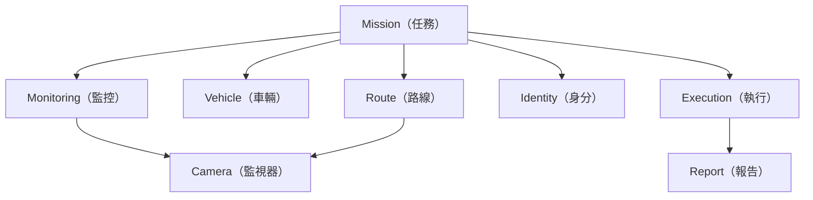

# Context Map（領域上下文圖）

- Version（版本）：2.0
- Status（狀態）：Approved（已核定）
- Last Updated（最後更新）：2026-08-08

## 1. Purpose（目的）

描述主要 Domain（領域）之間的責任與關係。

## 2. Context Map（上下文關係）

## 3. Mission（任務）

### Responsibility（職責）

- Mission Lifecycle
- Resource Allocation（資源配置）
- Mission Decision（任務決策）
- Mission Snapshot（任務快照）

### Not Responsible（非職責）

- 即時 GPS 計算
- CCTV Corridor Query
- 地圖 Rendering
- 即時 Traffic 計算

## 4. Route（路線）

### Responsibility

- Route Definition（路線定義）
- Waypoint
- Route Planning
- Route Editing

### Not Responsible

- Mission Assignment
- Camera Ownership
- GPS Tracking

## 5. Vehicle（車輛）

### Responsibility

- Vehicle Identity（車輛識別）
- Vehicle Type（車種）
- Vehicle Assignment Support
- Vehicle Tracking Data Interface

### Not Responsible

- Mission Lifecycle
- Camera Query

## 6. Monitoring（監控）

### Responsibility

- Camera Discovery（監視器查詢）
- Corridor Monitoring
- Favorite Camera
- TV Wall Interaction

### Not Responsible

- Mission Ownership
- Vehicle Ownership

## 7. Identity（身分）

### Responsibility

- User Identity（使用者身分）
- Authentication（驗證）
- Role
- Permission

### Not Responsible

- Mission Business Rules
- Route Calculation

## 8. Execution（執行）

Execution 是 Mission Run 的執行上下文。

### Responsibility

- 即時任務狀態
- GPS
- 即時事件
- 執行過程資料

### Not Responsible

- 修改歷史 Mission Decision
- 直接改寫 Mission Template

## 9. Report（報告）

### Responsibility

- Execution Summary（執行摘要）
- Plan vs Actual
- 任務耗時
- 完成時間
- 行駛距離
- 任務紀錄

## 10. Shared Camera（共用監視器）

Camera 是 Shared Data（共用資料）。

它可以被 Route Corridor Query 與 Monitoring 使用。

但不因被 Mission 使用就成為 Mission 的子 Entity。
