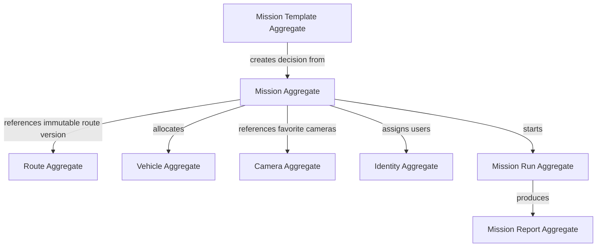

# Aggregate Map（聚合地圖）

- Version（版本）：2.0
- Status（狀態）：Proposed（提案）

## 1. Aggregate Principle（聚合原則）

Aggregate（聚合）是：

> 必須一起維持 Business Invariant（業務不變條件）的資料邊界。

不是每一張 Table 都是一個 Aggregate。

## 2. Proposed Aggregate Map（聚合地圖）



## 3. Mission Aggregate（任務聚合）

Root Entity（根實體）：

`Mission`

候選內部資料：

- Mission basic information
- Mission route decision
- Mission resource allocation
- Mission favorite camera decisions
- Mission planning status

Mission Aggregate 不持有：

- Camera master
- Vehicle master
- User master
- Route Corridor result
- GPS stream
- Real-time events

只持有必要 Reference 或 Snapshot。

## 4. Route Aggregate（路線聚合）

Root：

`Route`

Route 必須支援 Version（版本）。

```text
Route
 ├── Route Version 1
 ├── Route Version 2
 └── Route Version 3
```

Mission 應指向被採用的不可變 Route Version。

## 5. Vehicle Aggregate（車輛聚合）

Root：

`Vehicle`

保存：

- vehicle identity
- vehicle type
- vehicle specification
- availability / lifecycle status

不保存 Mission Run GPS 或 Mission-specific assignment history。

## 6. Camera Aggregate（監視器聚合）

Root：

`Camera`

Camera 是 Shared Data（共用資料）。

Mission 只保存 Favorite Camera Decision（重要監視器決策）。

## 7. Identity Aggregate（身分聚合）

目前候選：

- User
- Role
- Permission

實際 Role / Permission 是否各自成為獨立 Aggregate，待 Identity Blueprint 再核定。

## 8. Mission Run Aggregate（任務執行聚合）

Root：

`Mission Run`

內含或關聯：

- execution status
- start / end
- execution events
- tracking references

GPS Position 屬於高頻動態資料，不建議成為 Mission Aggregate 的子資料。

## 9. Mission Report Aggregate（任務報告聚合）

Root：

`Mission Report`

保存：

- completion summary
- duration
- distance
- execution records
- Plan vs Actual

Report 是歷史結果，不反過來修改 Mission。
